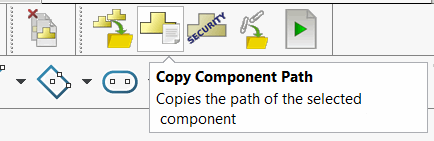

# Macro Library for SOLIDWORKS Automation


[Request macro](https://github.com/xarial/codestack/issues/new?labels=macro-request){ target="_blank" class="download-button" }

{ width=400 }

This page contains a library of useful macros, utilities and scripts for SOLIDWORKS engineers. Macros are grouped by categories: part assembly, drawing, performance etc.

Follow the [Programming VBA and VSTA macros using SOLIDWORKS API](/solidworks-api/getting-started/macros/) section for guidelines of using and creating macros in SOLIDWORKS.

Cannot find the macro for you? Submit the [request macro](https://github.com/xarial/codestack/issues/new?labels=macro-request) form and our team will review your request and will try to add the macro to the library.

## Best practices for organizing macro library

[Toolbar+](https://cadplus.xarial.com/toolbar/) is a part a free and open-source [CAD+ Toolset](https://cadplus.xarial.com/) add-in for SOLIDWORKS which allows organize the macro library in custom toolbars integrated to SOLIDWORKS environment. Add-in also allows to manage multi-user environment by storing the configuration in the centralized location.

{ width=450 }

Alternatively macro buttons can be created using native SOLIDWORKS functionality. Read [Creating macro buttons in SOLIDWORKS toolbars](/solidworks-api/getting-started/macros/macro-buttons/) for more information.

Explore this section to find productivity and automation tools which suit your needs.

For additional productivity add-ins visit the [SOLIDWORKS Labs](/labs/solidworks/) page.

## Batch Running

in some cases it might be required to batch run macros for multiple files or folders with SOLIDWORKS files. Try [Batch+](https://cadplus.xarial.com/batch/) is a free stand-alone application part a free and open-source [CAD+ Toolset](https://cadplus.xarial.com/).

---

