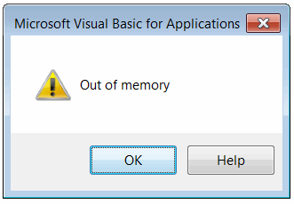
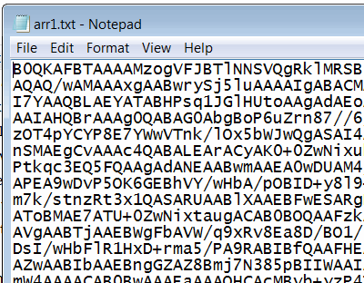
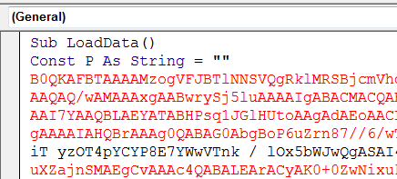
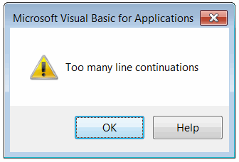

In some cases it might be required to embed file or data directly into the Visual Basic 6 project or VBA macro. Resources are not supported in Visual Basic. The below functions demonstrate how to embed the binary array into the macro without the need to redistribute the data file.

## Writing the array declaration

This option allows to output the array declaration into a text format which can be copy-pasted to the macro as variable declaration

~~~vb
Dim buff(5) As Byte
buff(0) = 1: buff(1) = 2: buff(2) = 3
buff(3) = 4: buff(4) = 5: buff(5) = 6

WriteArrayDeclarationToFile buff, "D:\arr.txt", "arr", "Byte", 2
~~~

Just copy the content of the generated file and paste into the macro module to embed the data.



This approach however has a limitation as the size of the file would be much bigger than the size of the array (e.g. array of size 500 KB would generate the file of about 10 MB). This results into the *'Out of memory'* error in Visual Basic

## Writing the base64 encoded array

As the workaround array can be embedded as Base64 string. Follow the following article for the code example of [encoding the byte array into base64 string](/visual-basic/algorithms/data/encoding/base64#encode)

~~~vb
Dim buff(100) As Byte
...
WriteByteArrayDeclarationToFileAsBase64 buff, "D:\arr1.txt"
~~~

This would result in the following file to be created:

{ width=350 }

Declare the string constant and paste the value from this file. [Decode](/visual-basic/algorithms/data/encoding/base64#decode) this string to get the byte array.

This solution can also run into the limitation of the maximum symbols per line.

To overcome this use the 3rd parameter of *WriteByteArrayDeclarationToFileAsBase64* method which allows to set the maximum number of symbols and automatically split the line with line continuation symbol:

~~~vb
WriteByteArrayDeclarationToFileAsBase64 buff, "D:\arr1.txt", 100
~~~

The function provides the workaround for the limitation of maximum numbers of continuations which is equal to 24 (*'Too many line continuations'*) and splits the data in different functions.

As the result the data is written to the file in the following format:

{ width=350 }

To use this, copy the content into the module and call the *GetBase64Buffer* function from the code which will return the base 64 encoded array which can be [decoded](/visual-basic/algorithms/data/encoding/base64#decode).


