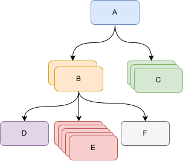

In some cases it might be required to parse the hierarchical data. This is a tree-structured data which has a collection of nodes while each node may contain the collection of children, and each child can have a collection of its own children and so on. Example of hierarchical data is an XML file which contains the nodes which might have sub-nodes.

This data can be parsed using [loops](/visual-basic/loops/), however this task would be complicated and code readability will be compromised. Much easier solution would be an employment of recursion technique.

This function will parse the single node (or node on a single level) and then call itself recursively to process all children nodes.

For example the following Bill Of Materials (BOM) structure represents a product.

{ width=350 }

This structure is described with the following class in the Visual Basic, where **Children** variable may contain children of the sub-assembly node.

## BomItem Class



In order to output the structure the following function can be written



As the result the following information will be output to the Immediate Window of VBA Editor.

~~~
A (1)
-B (2)
--D (1)
--E (5)
--F (1)
-C (3)
~~~
