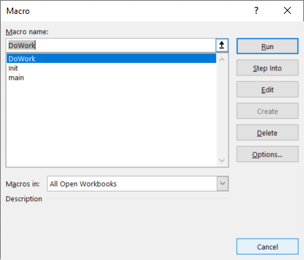
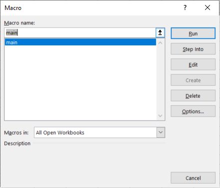
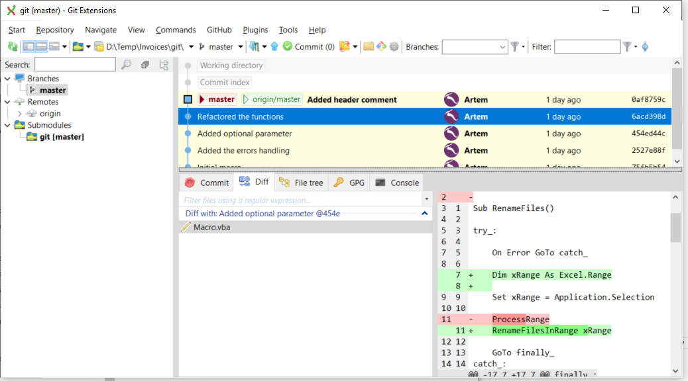

In nowadays Visual Basic is mainly used in VBA macros format with a minor exception of several legacy applications.

Although VBA macros are usually small applications, those are still playing a major role in millions of organizations worldwide. As macros are applications, they should be considered as such and all the practices for writing reliable, maintainable and stable application should still be applied when developing macros.

Below is the list of guidelines for improving the quality of the macro. These guidelines applies to any type of the macro, e.g. MS Word, MS Excel, SOLIDWORKS, Autodesk Inventor etc.

Visit [5 best practices to make your VBA macro great](https://blog.xarial.com/vba-macro-best-practices/) blog article for the video demonstration of the practical application of the below guidelines.

## Descriptive Names

When developing any application (VBA is not an exception) try to use as descriptive as possible names for variables, functions, procedures, modules, classes and events. 

Prefer to use descriptive names instead of comment

Use

~~~ vb jagged
Dim dayOfTheWeek As String
dayOfTheWeek = "Monday"
~~~

instead of

~~~ vb jagged
'day of the week
Dim x As String
x = "Monday"
~~~

Do not overload code with comments for the obvious snippets. Comment in the snippet below is redundant

~~~ vb jagged
Function GetCircleArea(radius As Double)
    const PI As Double = 3.14

    'Finding the area of the circle
    Dim area As Double
    area = PI * radius ^ 2
    GetCircleArea = area
End Function
~~~

## Error Handling

When developing code, avoid 'hiding the problem' as this may potentially cause more damage than crash of the application.

For example, the following snippet checks if the *swModel* object is not nothing and performs important operation. However, having the *swModel* equal to Nothing is possible scenario and skipping the export without notifying the user, will keep the problem unnoticed and user will not be able to understand why *DoSomeImportantWorkWithModel* was not performed on this model.

~~~ vb jagged
Dim swModel As SldWorks.ModelDoc2
Set swModel = swComp.GetModelDoc2()
If Not swModel Is Nothing Then
    DoSomeImportantWorkWithModel swModel
End If
~~~

### Errors Processing

*On Error Resume Next* directive should be used with caution. Aim to process all exceptions in your code. I would recommend to handle all errors in the centralized (usually the entry function).

The below format is not a regular VBA format for handling an error and it is trying to emulate try-catch-finally syntax from other languages, such as C#, VB.NET, C++, JavaScript etc., but it allows to make code more readable and easy to understand:

* DoWork() is a main function performing all the operations
* If at any point exception is thrown, code will be redirected to *catch_* block, where error can be processed (e.g. logged or message box is displayed)
* Otherwise, code will be redirected to *finally_* block and exit the macro once the *DoWork* routine is completed

~~~ vb
Sub main()

try_:
    On Error GoTo catch_
    
    DoWork()

    GoTo finally:
catch_:
    MsgBox Err.Description
finally_:

End Sub
~~~

### 'Fail Fast' Approach

To fix the above issue we can go with 'Fail Fast' approach, i.e. terminate the execution immediately, notifying the caller that something went wrong:

~~~ vb jagged
If Not swModel Is Nothing Then
    DoSomeImportantWorkWithModel swModel
Else
    Err.Raise vbError, "", "Model of the component is null. Execution terminated"
End If
~~~

And it is up to the calling function to decide what to do with this case. Depending on the requirement application can proceed and consider this as safe error or it can log the error or display the message to the user.

## Entry Point

Most of the VBA macro enabled applications, such as MS Word, MS Excel, SOLIDWORKS, Autodesk Inventor would consider any parameterless function as a potential entry point of the macro.

The code below has 3 parameterless functions

* main - Actual expected entry function. Running this function will result into expected outcome
* Init - Function which initialized data, required to do work. This function itself doesn't perform the work. Running this as an entry point will not cause errors, but it will not produce any results
* DoWork - Function which performs the work, however, it requires InitData to be initialized. Running this function directly will most likely result into the 'Run time error 91: Object variable block variable set'

~~~ vb
Dim InitData As Object

Sub main()
    Init
    DoWork
End Sub

Sub Init()
    'Initializes InitData
End Sub

Sub DoWork()
    'Consumes InitData to perform the work
End Sub
~~~

All the above 3 functions can be selected when running the macro

To prevent the potential issues, keep parameterless functions only for entry points. To make the function with parameter, without compromising an existing code, use optional parameter:

~~~ vb
Dim InitData As Object

Sub main()
    Init
    DoWork
End Sub

Sub Init(Optional dummy As Variant = Empty)
    'Initializes InitData
End Sub

Sub DoWork(Optional dummy As Variant = Empty)
    'Consumes InitData to perform the work
End Sub
~~~

With the setup above, only one function will be available for running:

## Independent Functions And Modules

Try to keep functions and modules as independent as possible from another functions, module level variables and environment. This would make a consumption of the function more predictable and function can be reused.

### Dependency On Members

In the below code snippet the *swModel* variable is declared at the module level which makes it accessible from within the *ProcessDocument* function. Variable is initialized in the *main* function. It means that *ProcessDocument* is dependent on the *swModel* and will be only able to work with active document (or the one assigned to *swModel*). This function cannot be reused for another purpose, e.g. processing the model of the component in the assembly.

~~~ vb
Dim swModel As SldWorks.ModelDoc2

Sub main()
    Set swModel = ActiveDoc
    ProcessDocument
End Sub

Sub ProcessDocument()
    'Do work with swModel
End Sub
~~~

Instead the above code could be rewritten to the following code. Instead of declaring the model level variable, it can be defined as the parameter of the function, thus removing the dependency. Now *ProcessDocument* function can be used with any pointer to *SldWorks.ModelDoc2*

~~~ vb
Sub main()
    ProcessDocument ActiveDoc
End Sub

Sub ProcessDocument(model As SldWorks.ModelDoc2)
    'Do work with model
End Sub
~~~

### Dependency On Environment

Another example is dependency on environment. Function below saves the value from the Excel cell into the text file. It takes 2 parameters for cell and the file path. However, this function doesn't perform any Excel specific functionality rather than calling the *Value* property on the cell to extract the text. But because of this, *CreateTextFile* function is dependant on the Excel environment and cannot be reused in other scenarios and applications (such as MS Word or Autodesk Inventor).

~~~ vb
Sub CreateTextFile(cell As Excel.Range, fileName As String)
    Dim text As String
    text = cell.Value
    'write text to fileName
End Sub
~~~

Instead the function can be changed to the following code, where the caller is responsible for preparing the text for writing. This function can then be copied to another macros to perform similar functionality if required.

~~~ vb
Sub CreateTextFile(text As String, fileName As String)
    'write text to fileName
End Sub
~~~

## Documentation

Documentation the functionality of your application could be very useful for the users of your software and for other collaborators of your project. The documentation can be as simple as text file, Word or PDF document or complete multi page technical site. 

For VBA macros simple header at the top of the macro can be sufficient. Specify the author of the macro, license, contact details and brief description

~~~ vb jagged-bottom
' -------------------------------------------------
' Created By Artem Taturevych (info@codestack.net)
' License: https://www.codestack.net/license/
' Macro will display the callouts with the diameter values of all selected circular edges in the 3D model
' -------------------------------------------------

Sub main()
~~~

## Referencing 3rd Party Type Libraries

When just few objects or functions from the 3rd party type library are used (e.g. Microsoft Scripting Runtime, Microsoft Excel, etc.) and this is not a primary target of automation, consider using them with [Late Binding](/visual-basic/variables/declaration#late-binding) instead of an [Early Binding](/visual-basic/variables/declaration#early-binding)

For example Excel VBA macro needs to create a [dictionary](/visual-basic/data-sets/dictionary/) object to hold key-value pairs. Instead of referring the *Microsoft Scripting Runtime* reference and using the following code

~~~ vb
Dim dict As Scripting.Dictionary
Set dict = New Scripting.Dictionary
~~~

It is possible to avoid adding the *Microsoft Scripting Runtime* reference and instead use

~~~ vb
Dim dict As Object
Set dict = CreateObject("Scripting.Dictionary")
~~~

Another example is SOLIDWORKS VBA macro, which primarily automates SOLIDWORKS, while some Excel API invocation might be required. In this case Excel can be created as late bound object and no references to Excel library need to be added to the macro.

This approach allows to simplify the compatibility between different versions of library and avoid [missing references issue](/solidworks-api/troubleshooting/macros/missing-solidworks-type-library-references/)

> Late binding has a limitation and some of the methods cannot be invoked with late binding, in this case early binding is an only option

## Use Asserts

*Debug.Assert* is a mechanism of displaying an assert when the condition is not met. Asserts are developer (not user) facing messages and intended to be used to validate conditions which are not the part of the use or misuse of the application. Assert should indicate the error in the code logic, but not the error in the use of the software.

For example the following SOLIDWORKS macro suppose to perform an operation on the active document. However it is a valid scenario where ActiveDoc can return *Nothing*. If macro runs when no document open (and user can do this), this would result in Nothing. So assert would not be an appropriate here to indicate the error, rather an exception would fit here better.

~~~ vb
Dim swModel As SldWorks.ModelDoc2
Set swModel = swApp.ActiveDoc
If Not swModel Is Nothing Then
    'do work
Else
    Err.Raise vbError, "", "No active document found"
End If
~~~

On the other hand *GetTitle* function below, runs a custom code to find the title of the document. It is assumed that regardless of the circumstances, title can never be an empty string, so empty string returned from *GetTitle* indicates the logic error. Assert would be thrown if its condition is False (title <> "").

~~~ vb
Dim title As String
title = GetTitle(model);
Debug.Assert title <> ""
~~~

## Use Unit Tests

Visual Basic is not designed for unit tests, there are several 3rd party solutions available for unit tests implementation.

As a workaround, simple validation function can be implemented in the macro to emulate unit testing. This testing function should be run manually.

In the below code there are 2 functions which are the part of the macro logic:

* SortArray - sorts input array in ascending or descending order and returns result
* CountWords - counts the number of words in the specified test

Those functions can be tested independently as units (unit tests)

*UnitTests* functions defines and validates several test cases. 

~~~ vb
Sub main()
    'main logic of the application which utilizes SortArray and CountWords
End Sub

Sub UnitTests(Optional dummy As Variant = Empty)
    
    'test1
    res1 = SortArray(Array("C", "B", "A"), True)
    Debug.Assert res1(0) = "A" And res1(1) = "B" And res1(2) = "C"
    
    'test2
    res2 = SortArray(Array("C", "B", "A"), False)
    Debug.Assert res2(0) = "C" And res2(1) = "B" And res2(2) = "A"
    
    'test3
    Dim res3 As Integer
    res3 = CountWords("Hello World")
    Debug.Assert res3 = 2
    
End Sub

Function SortArray(arr As Variant, asc As Boolean) As Variant
    'sorts an array and returns the result
End Function

Function CountWords(text As String) As Integer
    'counts the words in the text
End Function
~~~

For example, *test1* runs the *SortArray* functions and supplies an array of [C, B, A] requesting the sorting in ascending order. The expected outcome is an array [A, B, C] which is a validated in the *Debug.Assert* call. If the condition is false, assert will be thrown indicating the failure of the test.

~~~ vb jagged
'test1
res1 = SortArray(Array("C", "B", "A"), True)
Debug.Assert res1(0) = "A" And res1(1) = "B" And res1(2) = "C"
~~~

## Version Control

Control Version Systems (CVS) for source code provide a centralized management of the code in the plain text formats. Such systems include, but not limited to Git, SVN, Mercurial.

Most of VBA macro engine implementations in various applications such as MS Word, MS Excel, SOLIDWORKS, Autodesk Inventor store macro files either as embeded into a file or in the binary format which makes it unpractical to use with Control Version Services.

It is however still beneficial and recommended to extract a text copy of the macro code and add this under the revision control.

## Stay Within The Scope

Try to keep your applications within the capacity of the technology and programming language. For a simple applications, scripts and VBA macros can be sufficient, but for more complicated functionalities where database connection, web service calls, data processing and analyzing etc. is required consider switching to more sophisticated environments (add-ins, stand-alone applications, web services) and OOP languages, such as VB.NET, C#, C++, Java etc.