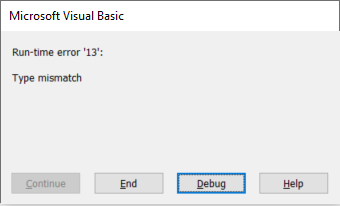

Conditions are vital parts of any application as this is usually what drives the logic of an application.

There are multiple options available in Visual Basic to execute certain code based on the condition

## If Statement

This is the most common way to decide if the code within the **If** statement body should be executed. If statement simply evaluates the expression to Boolean **True** or **False** and executes the code if expression is **True**. This means that all expressions must result in either **True** or **False** value

~~~ vb jagged
If True Then
    Debug.Print "Always Prints"
End If
~~~

However the following code will result in the runtime exception as String value cannot be cast to Boolean

~~~ vb jagged
If "A" Then
End If
~~~

while the following snippet is valid as comparison of 2 String values results into the Boolean value

~~~ vb jagged
If "A" = "A" Then
End If
~~~

### Fallback Value

It is possible to specify the fallback value for the statement, i.e. block of code which should be executed if the main condition is **False**



### Multiple Сonditions

It is possible to specify multiple conditions as well as combine the expressions with [logical operations](#logical-operators)



Conditions are executed one-by-one until the **True** condition is found

## Select Case

If it is required to perform the check against multiple constant values, instead of using **If-ElseIf** it is possible to use **Select Case**. Although, **Select Case** can be considered redundant to **If-ElseIf**, it is widely used as it allows to create a simple, more readable code. **Select Case** statement also supports fallback value using the **Case Else** statement.

The below code converts the position of the day in the week to its text representation. It throws an error if the specified value is outside of 1-7 range as this would be an invalid input.



## Logical Operators

Visual basic supports 3 logical operators: **And**, **Or** and **Not**

* Result of **And** operators will be equal to **True** if all of its arguments are equal to **True**
* Result of **Or** operators will be equal to **True** if at least one of its arguments is equal to **True**
* **Not** operator reverses the value

Operators can be grouped with parenthesis to define the order of operations



The following table demonstrates the results based on the values and operator

| Value1 | Value2 | Operator | Result |
|--------|--------|----------|--------|
| True   | True   | And      | True   |
| True   | False  | And      | False  |
| False  | True   | And      | False  |
| False  | False  | And      | False  |
| True   | True   | Or       | True   |
| True   | False  | Or       | True   |
| False  | True   | Or       | True   |
| False  | False  | Or       | False  |
| True   | N/A    | Not      | False  |
| False  | N/A    | Not      | True   |
