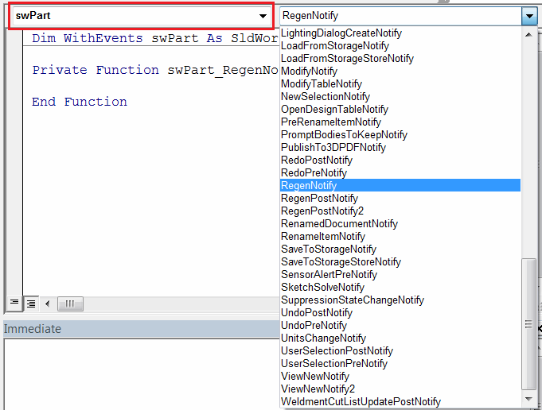
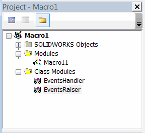

Event is a mechanism of providing a notification to external listeners when certain action occurs. For example your object might need to tell its listeners that it is loaded, updated or removed. In Microsoft Office application example of the event would be: opening of the document, entering text in MS word, recalculating the value of cell in Excel, etc.

When developing automation software events are handled to invoke custom functionality, e.g. add log entry when cell value is changed in Excel.

It is possible to consume (handle) events of existing object or declare and raise your own events in custom classes.

## Handling events

If object exposes events it is required to declare this object as [class](/visual-basic/classes/) variable and use **WithEvents** keyword

~~~ vb
Dim WithEvents myObj As CustomObjectWithEvents
~~~

Visual Basic Editor will show all available events in the drop-down as shown below, and it is possible to select the required event from the list to subscribe to the notification.

{ width=450 }

Event handler function should be named as *{Variable Name}_{Event Name}* and match the signature of the event

~~~ vb
Function myObj_SomeEvent(someParam As String) As Integer 'Handling 'SomeEvent' of 'myObj' variable
    myObj_SomeEvent = 0
End Function
~~~

## Declaring events

Events can be declared in the [class](/visual-basic/classes/) using the **Event** keyword. Signature of the event must be specified by providing the parameter names and their types in the parenthesis.

The following example demonstrates how to raise and handle the event.

The project tree looks the following:

### EventsRaiser Class Module

This class raises the event named *Completed* with a string parameter of *timeStamp*. Event is raised when the *DoWork* method is called.

~~~vb
Public Event Completed(timeStamp As String)

Public Sub DoWork()
    'Do work
    RaiseEvent Completed(Now)
End Sub
~~~

## EventsHandler Class Module

This class handles the event and displays the message box.

~~~vb
Dim WithEvents myEventRaiser As EventsRaiser

Private Sub Class_Initialize()
    Set myEventRaiser = New EventsRaiser
    myEventRaiser.DoWork
End Sub

Private Sub myEventRaiser_Completed(timeStamp As String)
    MsgBox "Completed: " & timeStamp
End Sub
~~~

## Macro11 Module

This module is an entry point which instantiates an instance of the events handler and keeps it in the memory.

~~~vb
Dim swEventsHandler As EventsHandler

Sub main()
    
    Set swEventsHandler = New EventsHandler

End Sub
~~~
