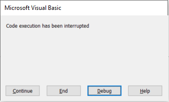

Loops in programming is a technique to iterate over the elements of [collections](/visual-basic/data-sets/collection/) and [arrays](/visual-basic/data-sets/array/) and other data sets.

The following sections explains different types of loops. All the below snippets based on a simple array of *String* which is declared below:



However similar technique can be used with any type of arrays.

## For-Next

This is probably the most common loop type. It allows to perform specified number of iterations. By default each loop iteration will increment the value of index by one.



The above sample will print all values from the array:

> A B C D E F G H I J

Alternatively, different value for step can be specified with the *Step* keyword. Step can be negative to iterate in reverse direction.



The above code would output values in the reverse direction:

> J I H G F E D C B A

## While-Wend

This loop executes while the condition is *True*

This type of loop can be useful when number of iterations is not known in advance.



The above code would output and terminates when the current element equals to *D*:

> A B C D

## Do-Loop While

**Do-Loop While** are similar to **While-Wend** loops with an exception that the condition executed after the step, so it ensures that at least one iteration will be performed regardless of the condition



The above code would produce:

> A B C D

## For Each-Next

Although in most cases **For-Next** loop is used to iterate over the elements of an array it is not restricted to this use case only. Any code can be executed within the body of the loop.

To specifically iterate over the elements of an array **For Each-Next** loop can be used



The above snippet would output:

> J I H G F E D C B A

## Infinite Loops

Incorrect use of loops conditions may result into infinite loop. Such code usually results in the software hang or crash.

For example the below loop would run infinitely as **i** variable is never incremented.



To terminate the infinite loop (or any running code in VBA) it is possible to press the combination of keys: *ctrl+alt+pause/break*

This would display the below message box and code can be stopped or entered into debug mode.

