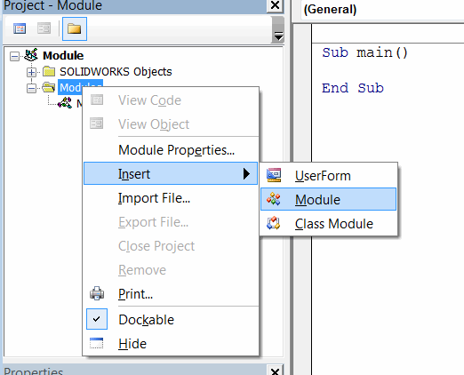
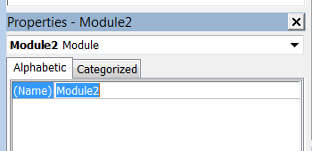
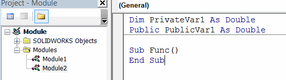
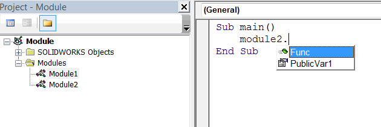

Modules are containers to define custom functions, procedures or variables to group code in Visual Basic.

Module containing an entry point subroutine (main) is an entry module. It is always at least one module defined in the Visual Basic macro.

In order to add new module it is required to RMB (right mouse button click) the **Modules** folder and select *Inset->Module* command

{ width=250 }

Module must have an unique name which can be defined by the developer.

Functions defined in module are public. Members (variables) declared with **Dim** keyword are only visible within this module scope and not visible for another modules, while members declared with **Public** keyword are visible for this and other modules. Refer [Variables Scope](visual-basic/variables/scope) article for more information.

Module members are available in IntelliSense after typing the name of the module followed by . symbol.

