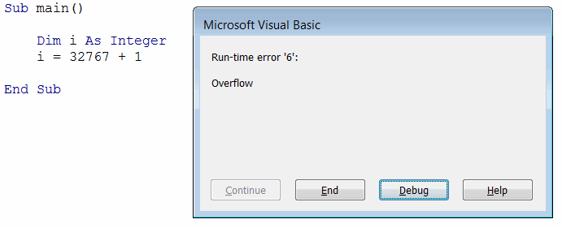

The following classifications list different standard types in Visual Basic grouped by categories. Each type allocates different size of memory storage. Some of the types have declaration character which can be used to explicitly define the type of the variable in a short form. Most of the types provide specific function to convert the value from a variant.

### Numeric

Numeric type variables are used to hold positive and negative integer values (without the decimal point), e.g. 1, 2, 10, -10, -1000 etc. Different numeric types allow storing different value ranges and requires different size of the allocated storage. The most commonly used type is [Integer](#integer).

If the assigned value doesn't fit the range Run-time error '6' overflow will be displayed at the compile time.

{ width=350 }

#### Byte
Allocates 1 byte of storage. Value ranges from 0 through 255. The function of converting to Byte is *CByte*.

#### Integer
Allocates 2 bytes of storage. Value ranges from –32,768 through 32,767. The type declaration character for integer is %. The function of converting to Integer is *CInt*.

#### Long 
Allocates 4 bytes of storage. Value ranges from –2,147,483,648 through 2,147,486,647. The type declaration character for long is &. The function of converting to Long is *CLng*

#### LongLong
Allocates 8 bytes of storage. Value ranges from -9,223,372,036,854,775,808 through 9,223,372,036,854,775,807. Type declaration character for LongLong is ^. LongLong is a valid declared type only on 64-bit platforms.

#### LongPtr
Represents [Long](#long) type (4 bytes) on 32-bit systems and [LongLong](longlong) type (8 bytes) on 64-bit systems.

LongPtr usually used for writing portable code that can run in both 32-bit and 64-bit environments. In particular this is used in [Windows 32 APIs](visual-basic/windows-api) for pointers and handles.

### Numeric with decimal point
These types of variables are used to hold positive and negative numeric values with decimal points, i.e. 20.5, -152.89 etc. Different type of variables allow to store different value ranges with different precisions. The most commonly used type is [Double](double). For high precision numbers either [Currency](currency) or [Decimal](decimal) types can be used.

#### Single
Allocates 4 bytes of storage. Value ranges from –3.402823E38 through –1.401298E–45 or 1.401298E–45 through 3.402823E38. The type declaration character for single is !. The function of converting to Single is *CSng*

#### Double
Allocates 8 bytes of storage. Value ranges from –1.79769313486232E308 through –4.94065645841247E–324 or 1.79769313486232E308 through 4.94065645841247E–324. The type declaration character for double is #. The function of converting to Single is *CDbl*

#### Currency
Allocates 8 bytes of storage. Value ranges from –922,337,203,477.5808 through 922,337,203,685,477.5807. The type declaration character for integer is @. The function of converting to Currency is *CCur*

#### Decimal
Allocates 14 bytes of storage. Value ranges from -79,228,162,514,264,337,593,543,950,335 through 79,228,162,514,264,337,593,543,950,335 or –7.2998162514264337593543950335 through 7.9228162514264337593543950335.  The function of converting to Decimal is *CDec*. Note that variable of type Decimal must be declared as [Variant](visual-basic/variables/standard-types#variant) and assigned using *CDec* function.

### Logical
Logical variables are used in [conditions](visual-basic/conditions) and presented as 1 (True) or 0 (False)

#### Boolean
Allocates 2 bytes of storage. Either True or False. The function of converting to Boolean is *CBool*

### Text
Text variables are holding literals and when defined are enclosed in double quotes "".

#### String
Allocates 10 bytes plus the number of characters of storage. Value ranges from 0 through 2 billion characters. The function of converting to String is *CStr*

### Date and Time
Variable holding the information about date and time.

### Date
Allocates 8 bytes of storage. Value ranges from January 1, 100 to December 31, 9999. The function of converting to String is *CDate*

### Reference 
These variables are any reference types which might hold complex data and structures.

#### Object
Allocates 4 bytes of storage. Used in [Late Binding](visual-basic/variables/declaration#early-binding-and-late- binding)

### Any
These variable types can hold any data object (either value type, reference type or arrays)

#### Variant
Allocates 16 bytes of storage. The function of converting to Variant is *CVar*

The code example below demonstrates declaration and conversion of various standard data types.


