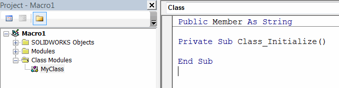

## Enumerations
Enumerations are Visual Basic data types which hold sets of integer constants. Enumerations are useful to define family of constants to be used by the developers (i.e. options).

Refer [Enumerations](visual-basic/data-structures/enumerators) article for more information about enumerators.

Enumerators are treated as any other data types and can be declared and assigned. Enumerations can be assigned implicitly and explicitly.

~~~ vb
Dim myEnumVal As MyEnum_e
Dim myEnumVal1 As MyEnum_e
myEnumVal = MyEnum_e.Val1 'assigning the enumerator explicitly stating the name of enumerator
myEnumVal1 = Val1 'implicit assignment of the enumerator
~~~

## Type

Visual Basic allows to create new data groups. Custom user-defined Type is a data type, also known as *Structure* which allows to define complex data storage. Types are useful when it is required to pass or store the data which consists of multiple elements (e.g. geometrical point, log entry, etc.)

Refer [Custom User Defined Types](visual-basic/data-structures/types) article for more information about custom types.

## Class
Unlike enumerations and types classes can only be created in separate Visual Basic class modules.

{ width=500 }

Classes are reference types and must be initiated with *new* keyword and reference must be assigned using *Set* keyword.

Refer [Classes](visual-basic/classes) article for more information about classes.

Code example below shows how to declare and assign enumerator, type and class.

*Class declaration*


*Module*

