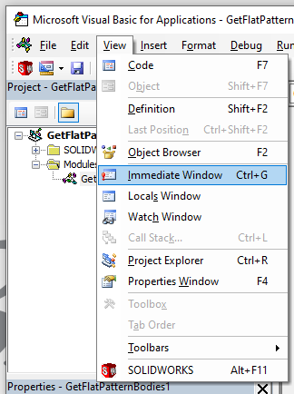
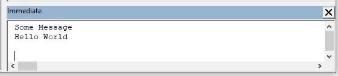

## Immediate Window

Immediate Window is a console which collects the output messages printed from the code.

Immediate window is usually used in debugging and troubleshooting as a simple way to output the log or the current state of variables.

To enable this window click the *View->Immediate Window* command ot *Ctrl+G* shortcut.

Window can be docked to any panel in VBA Editor.

In order to output messages to this window use *Debug.Print* command

~~~ vb jagged
Dim str As String
str = "Hello World"
Debug.Print "Some Message"
Debug.Print str
~~~

## Watch Window